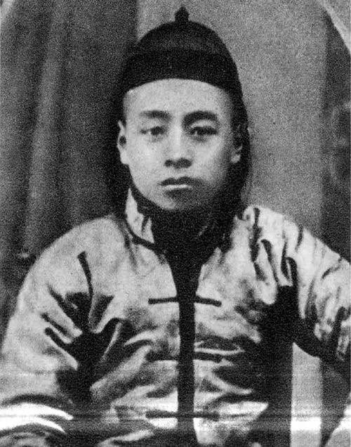

# 少年师爷的发型

其实 这个发型在粥 少年时期 是非常有代表性的，清朝刚刚被推翻，革命党刚掌权，随时面临着满清复辟，这时候一些革命立场不坚定的机会主义分子就留这种发型，一方面减掉辫子意味着“革命”，或者说被迫“革命”，当时革命党强调留辫不留头，另一方面，由于害怕满清复辟，头发现长又长不出来，到时候又有被满清割脑袋的危险，因此就留这种齐肩发，到时候随时把辫子再扎起来，这个发型实际上深刻反映了半殖民半封建社会中封建地主资产阶级等各色地富反坏右机会主义分子瞻前顾后左右摇摆的内心世界和软弱妥协投降的阶级本性。这个发型极其形象地概括了毒粥这类机会 主 义 反 动 派 的 两 面 派 投 降 派 本 质 。

文的学习生活 2023-04 回复 小明: 

同志们不要把阶级出身和个人割裂开，尽管阶级出身不等于一个人的阶级，但是绝大多数情况下是这样的，毒粥就是其中的典型代表。再就是同志们不要被资产阶级反动派误导，他们老是说，不要因为一个人后来的错误就把他前面做的事都否定了，这种观点是极其反动的，犯了形而上学错误，实际上把一个人割裂了，这个视频 [「8」说不完的毛选（一）怎么判定你是不是人民？](https://www.bilibili.com/video/BV1EE421A74s/?spm_id_from=333.1387.collection.video_card.click&vd_source=2cf1a71c5403f135e301f365e608ff9c) 

和 视频 [「23」如何鉴别马克思恩格斯列宁斯大林和伟人的原著（下）论阶级立场兼谈学历的生产机制【文的学习生活】](https://www.bilibili.com/video/BV1GD4y1y7Sk?spm_id_from=333.788.videopod.sections&vd_source=2cf1a71c5403f135e301f365e608ff9c)

讲 过 这 个 问 题 ，举个例子，有两种人，在建国前都舍身忘我，不怕牺牲，但是一种人是为建国后加官晋爵封妻荫子作新王侯将相取代被他们打倒的旧统治者继续压迫奴役人民，另一种人则想着继续为人民服务，继续做人民的孺子牛，但是建国前，这两种人都是爬冰卧雪，铁骨铮铮，和人民打成一片，对人民嘘寒问暖，他们是没什么不同的，恰恰是建国后的表现才能证明他们前面的意图。重要的是晚节啊，林总多次强调过这个问题。所以同志们一定要学会辩证地看待人，不要形而上地看待人。