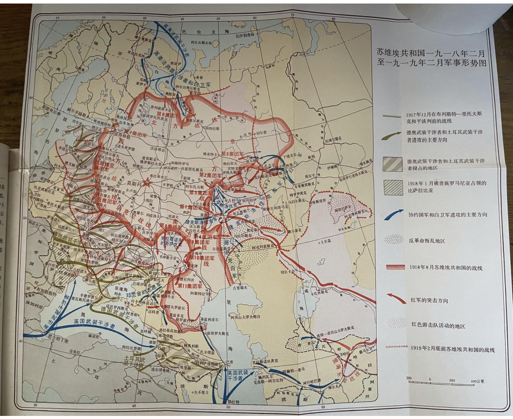
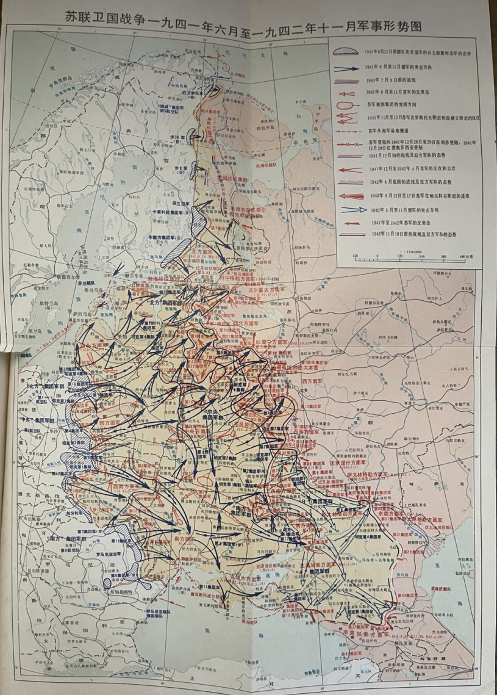
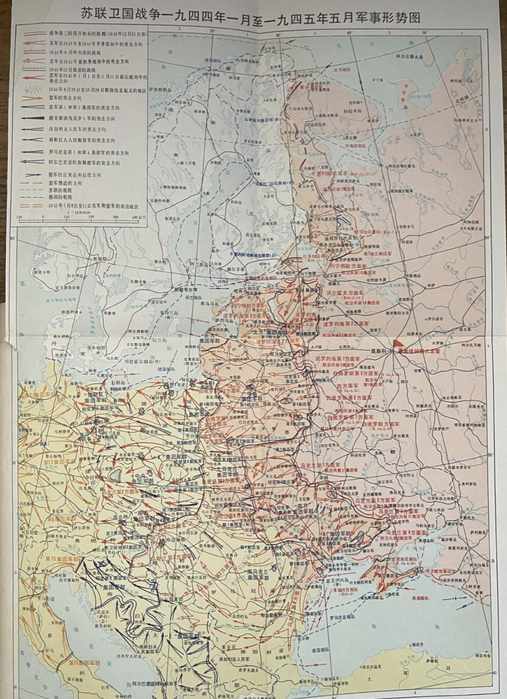

# 通过地图看到斯大林伟大的战略远见和高超的军事指挥艺术

图片来自斯大林军事文集 战士出版社 1981 年版也建议同志们看看斯大林军事方面的文章、电报、命令等，顺便击碎被全世界帝修反意淫包装出的“军事天才”托洛茨基。简单说，历史上真实的托洛茨基是插手哪里，哪里打败仗，指挥哪里，哪里出问题，托洛斯基是红军里的内奸、特务、工贼、放火队长(这都是事实，只是受我国几十年来反动党史的毒害，被很多小资产阶级认为是斯大林给托洛茨基罗织的罪名了，随着对我国真实党史的了解，同志们会越来越清晰地意识到，是我们的党史更颠倒一些，是人家的党史更真实一些，这和斯大林在苏共党内地位比伟人在 ZG党内地位相对高有关)，而斯大林才是列宁真正的救火队长，历史被颠倒了。

再就是朱可夫这个苏修的彭德坏，苏联红军里的反动军阀，如果说，托洛斯基是偷功司令，他就是偷功元帅，莫斯科保卫战成他指挥的了，斯大林格勒保卫战又成他指挥的了。朱可夫帮助赫鲁晓夫搞政变上台后，在自己回忆录里都不敢说得很露骨，结果现在这帮反动派把什么功劳都敢往朱可夫身上按，好像是朱可夫领导苏联红军打跑了法西斯打赢了二战，斯大林倒成了什么都不懂的蠢材了，用赫鲁晓夫的话就是拿着地球仪指挥战斗的暴君了。

<table>
    <tr>
    <td> 
 
</td>
    <td> 
 
</td>
    </tr>
</table>

同志们可以结合地图看苏芬战争的必要性和斯大林的战略远见 可以说苏芬战争直接改变了希特勒北方集团军群的主攻方向，要是当时苏联不提前拿下维堡等地区，就不可能有后来两年半的列宁格勒保卫战，希特勒很可能复制十月革命帝国主义干涉军的进攻路线，水路直接从白海直插苏联腹地，陆路直接从维堡入侵列宁格勒。同样对其他的地区的控制也是一个道理，直到法西斯正式入侵苏联，这些斯大林的战略远见才被很多人认识到。

想起大学时候毛概老师说赫鲁晓夫抹黑斯大林看地球仪制定作战计划

这是赫鲁晓夫秘密报告里的原话 对斯大林进行全方位的抹黑，凳吸取了赫鲁晓夫秘密报告的经验教训，更惮于林总当年对全党全军 全国人民发出的警告 ， 即“政变经” https://zhuanlan.zhihu.com/p/697784024 ，[马克思主义中文网-政变论](https://www.marxists.org/chinese/linbiao/mia-chinese-linbiao-19660518.htm)  中强调的:“毛主席活到哪一天，九十岁、一百多岁，都是我们党的最高领袖，他的话都是我们行动的准则。谁反对他，全党共诛之，全国共讨之。在他身后，如果有谁做赫鲁晓夫那样的秘密报告，一定是野心家，一定是大坏蛋，全党共诛之，全国共讨之。” 所以凳对为伟人来了个三七开，分了个建国前建国后。伟人早就在给江青的信中 https://zhuanlan.zhihu.com/p/698282736 说过:“这是一次全国性的演习，左派、右派和动摇不定的中间派，都会得到各自的教训。”

回复 moifky:  
获取军事知识的话，读斯大林、伟人和林总军事相关的文章就很好，要联系现在的俄乌战争，毛选中的那几篇军事相关的著作比如中国革命战争的战略问题 论持久战 抗日游击战争的战略问题 战争和战略问题等等把战争的本质，战争的样态，上到战略下到战术等等问题都讲明白了，至于斯大林和伟人为什么这么会打仗，伟人说得好，不仅要读有字书更要读无字书，要在战争中学习战争。战争就是最好的教科书，战场就是最好的学校，都是打出来的，实践锻炼出来的，检验出来的，说白了，军校里教不出军事天才来，不要小看希特勒，只是他碰到斯大林了，否则欧洲真能让他吞并了。林总本质上和没上黄埔一个样，接受了几个月的军事教育和训练，后来当连长的时候，第一场战斗都不是自己指挥的，不会打，是一个老兵教给他的，是战争锻造了这位蒋介石口中的“战争魔鬼”，其实红军将领里越是会打仗的往往越是没上过军校的，大多都是工农出身，看看皮定均，连学都没上过，说实在话，参加革命的时候大字都不识几个，再看看皮旅的中原突围，打得多好啊，深刻领会复制甚至提升了当年伟人的四渡赤水。地图的话，比如，同志们可以看看斯大林格勒方向，鲍卢斯的第八集团军基本都快拿下斯大林格勒了，但是大家再看看斯大林格勒外围，苏联红军对整个斯大林格勒的口袋阵都已经布好了，这还不算完，大家再看看整个北高加索地区，德国法西斯的整个南方集团军群都快被斯大林包饺子了，整个 A 集团军群已经都在包围圈里了，这个口袋一扎，整个南方集团军群就完蛋了，必然会成建制投降。现代战争最怕的就是围歼战，一旦把后勤掐断，再能打的军队都会丧失战斗力，子弹打一颗少一颗，炮弹打一发少一发，坦克跑一箱油少一箱油，随后枪炮坦克都成了烧火棍，铁棺材，这还不算士兵的吃喝拉撒呢。现在很多反动派都吹曼施坦因多会打仗，从这个巨大的口袋阵里把德国的几个精锐救出来了，实际上曼施坦因和希特勒心里最清楚，要不是鲍卢斯这支法西斯最精锐的集团军挺得时间长，相当于给他们殿后了，神仙来了也带不出一兵一卒。其实这也间接反映了苏联红军里有些集团军的指挥员执行斯大林的命令是不够坚决和彻底的。 

