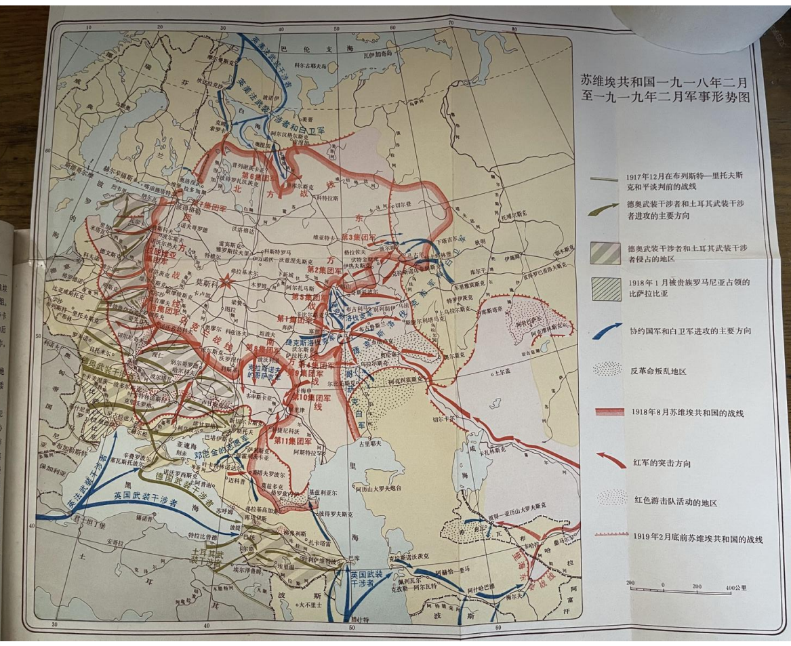
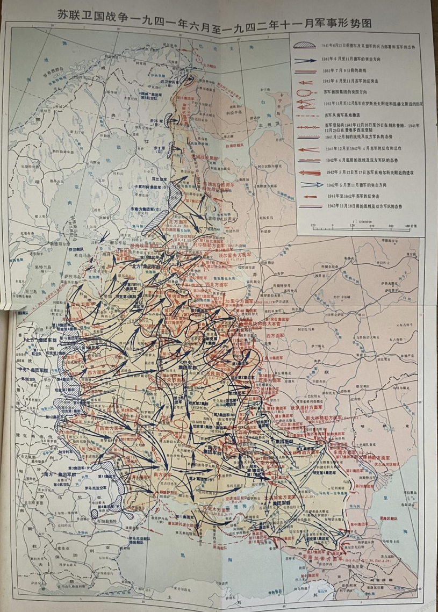
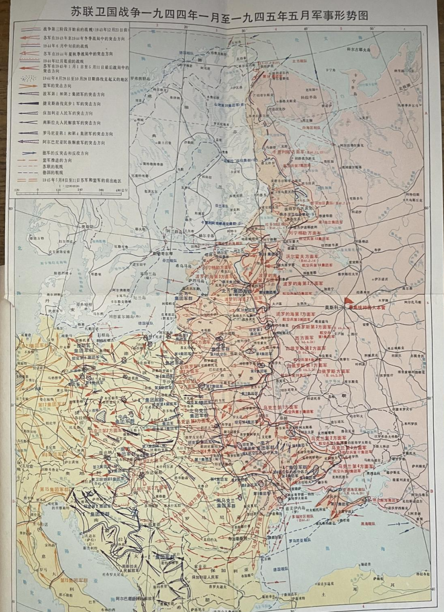

[TOC]

# 通过地图看到斯大林伟大的战略远见和高超的军事指挥艺术

图片来自《斯大林军事文集（战士出版社 1981 年版）》也建议同志们看看斯大林军事方面的文章、电报、命令等，顺便击碎被全世界帝修反意淫包装出的“军事天才”托洛茨基。简单说，历史上真实的托洛茨基是插手哪里，哪里打败仗，指挥哪里，哪里出问题，托洛斯基是红军里的内奸、特务、工贼、放火队长(这都是事实，只是受我国几十年来反动党史的毒害，被很多小资产阶级认为是斯大林给托洛茨基罗织的罪名了，随着对我国真实党史的了解，同志们会越来越清晰地意识到，是我们的党史更颠倒一些，是人家的党史更真实一些，这和斯大林在苏共党内地位比伟人在 中共党内地位相对高有关)，而斯大林才是列宁真正的救火队长，历史被颠倒了。

再就是朱可夫这个苏修的彭德坏，苏联红军里的反动军阀，如果说，托洛斯基是偷功司令，他就是偷功元帅，莫斯科保卫战成他指挥的了，斯大林格勒保卫战又成他指挥的了。朱可夫帮助赫鲁晓夫搞政变上台后，在自己回忆录里都不敢说得很露骨，结果现在这帮反动派把什么功劳都敢往朱可夫身上按，好像是朱可夫领导苏联红军打跑了法西斯打赢了二战，斯大林倒成了什么都不懂的蠢材了，用赫鲁晓夫的话就是拿着地球仪指挥战斗的暴君了。

<!-- <table>
    <tr>
    <td> 
 
</td>
    <td> 
 
</td>
    </tr>
</table> -->

同志们可以结合地图看苏芬战争的必要性和斯大林的战略远见 可以说苏芬战争直接改变了希特勒北方集团军群的主攻方向，要是当时苏联不提前拿下维堡等地区，就不可能有后来两年半的列宁格勒保卫战，希特勒很可能复制十月革命帝国主义干涉军的进攻路线，水路直接从白海直插苏联腹地，陆路直接从维堡入侵列宁格勒。同样对其他的地区的控制也是一个道理，直到法西斯正式入侵苏联，这些斯大林的战略远见才被很多人认识到。

想起大学时候毛概老师说赫鲁晓夫抹黑斯大林看地球仪制定作战计划

这是赫鲁晓夫秘密报告里的原话，这是他对斯大林进行全方位的抹黑。凳吸取了赫鲁晓夫秘密报告的经验教训，更惮于林总当年对全党全军 全国人民发出的警告，即“政变经”[马克思主义中文网-政变论](https://www.marxists.org/chinese/linbiao/mia-chinese-linbiao-19660518.htm) 中强调的:“**毛主席活到哪一天，九十岁、一百多岁，都是我们党的最高领袖，他的话都是我们行动的准则。谁反对他，全党共诛之，全国共讨之。在他身后，如果有谁做赫鲁晓夫那样的秘密报告，一定是野心家，一定是大坏蛋，全党共诛之，全国共讨之。**” 所以凳对为伟人来了个三七开，分了个建国前建国后。伟人早就在给江青的信中  [千古第一阳谋](https://github.com/Chuyao-rcn/sorted-articles/blob/main/%E4%BC%9F%E4%BA%BA%E6%96%87%E7%AB%A0/%E5%8D%83%E5%8F%A4%E7%AC%AC%E4%B8%80%E9%98%B3%E8%B0%8B.md)说过:“**这是一次全国性的演习，左派、右派和动摇不定的中间派，都会得到各自的教训。**”

 
</td>

 
</td>

回复 moifky:
获取军事知识的话，读斯大林、伟人和林总军事相关的文章就很好，要联系现在的俄乌战争，毛选中的那几篇军事相关的著作比如中国革命战争的战略问题 论持久战 抗日游击战争的战略问题 战争和战略问题等等把战争的本质，战争的样态，上到战略下到战术等等问题都讲明白了，至于斯大林和伟人为什么这么会打仗，伟人说得好，不仅要读有字书更要读无字书，要在战争中学习战争。战争就是最好的教科书，战场就是最好的学校，都是打出来的，实践锻炼出来的，检验出来的，说白了，军校里教不出军事天才来，不要小看希特勒，只是他碰到斯大林了，否则欧洲真能让他吞并了。林总本质上和没上黄埔一个样，接受了几个月的军事教育和训练，后来当连长的时候，第一场战斗都不是自己指挥的，不会打，是一个老兵教给他的，是战争锻造了这位蒋介石口中的“战争魔鬼”，其实红军将领里越是会打仗的往往越是没上过军校的，大多都是工农出身，看看皮定均，连学都没上过，说实在话，参加革命的时候大字都不识几个，再看看皮旅的中原突围，打得多好啊，深刻领会复制甚至提升了当年伟人的四渡赤水。地图的话，比如，同志们可以看看斯大林格勒方向，鲍卢斯的第八集团军基本都快拿下斯大林格勒了，但是大家再看看斯大林格勒外围，苏联红军对整个斯大林格勒的口袋阵都已经布好了，这还不算完，大家再看看整个北高加索地区，德国法西斯的整个南方集团军群都快被斯大林包饺子了，整个 A 集团军群已经都在包围圈里了，这个口袋一扎，整个南方集团军群就完蛋了，必然会成建制投降。现代战争最怕的就是围歼战，一旦把后勤掐断，再能打的军队都会丧失战斗力，子弹打一颗少一颗，炮弹打一发少一发，坦克跑一箱油少一箱油，随后枪炮坦克都成了烧火棍，铁棺材，这还不算士兵的吃喝拉撒呢。现在很多反动派都吹曼施坦因多会打仗，从这个巨大的口袋阵里把德国的几个精锐救出来了，实际上曼施坦因和希特勒心里最清楚，要不是鲍卢斯这支法西斯最精锐的集团军挺得时间长，相当于给他们殿后了，神仙来了也带不出一兵一卒。其实这也间接反映了苏联红军里有些集团军的指挥员执行斯大林的命令是不够坚决和彻底的。

# 伟大的世界无产阶级革命领袖斯大林逝世70周年

（于 2023年 3月 5日）
斯大林被毒杀是以赫鲁晓夫为首的苏联走姿派送给毒粥最好的生日礼物。这次政变极大地增强了毒粥搞政变的信心。

文 回复 圣杯九: 只有部分内地人蒙在鼓里, 全世界知道点中共党史的都知道他和伟人不是一路的, 根本不是什么最佳搭档, 更不是什么 “毛粥朱” 铁三角。

## 最伟大的友谊（毛主席为斯大林所致悼词）

（一九五三年三月九日）

当代最伟大的天才，世界共产主义运动伟大的导师，不朽的列宁的战友——约瑟夫·维萨里奥诺奇·斯大林同志与世长辞了。

斯大林同志在理论的活动上和在实际的活动上所给予我们当代的贡献，是不可估量的。斯大林同志代表了我们整个的一个新时代。他的活动引导苏联人民和各国劳动人民转移了全世界的局面，这即是正义的、人民民主的和社会主义的事业在世界大规模的范围内，在地球上人口三分之一——八万万人以上的范围内取得了胜利，而且这种胜利的影响，正日益普及到全世界的每一个角落。

斯大林同志的逝世，使全世界的劳动人民感到了无可比拟的沉重的悲痛，激动着全世界的正义的人们的心。这就是表明，斯大林同志的事业和他的思想掌握了全世界的广大人民群众，而且业已变成了无敌的力量，这种力量将引导那已取得胜利的人民由胜利进入新的胜利，同时也将引导那一切还在邪恶的资本主义旧世界压迫下呻吟的人们能够对于人民的敌人进行勇敢的冲击。

在列宁逝世之后，斯大林同志指导苏联人民，把他和伟大的列宁在十月革命时期共同缔造的世界第一个社会主义国家建成了光明灿烂的社会主义社会。苏联社会主义建设的胜利，这不只是苏联人民的胜利，而且是全世界人民共同的胜利。第一、这个胜利用最现实的生活证明了马克思列宁主义的无限正确，具体地教育了全世界劳动人民应该如何朝着美好的生活前进。第二、这个胜利保证了在第二次世界大战中人类能够有战胜法西斯野兽的力量。不能设想，没有苏联社会主义建设的胜利，而能够有反法西斯战争的胜利。苏联建设社会主义的胜利和反法西斯战争的胜利是关系全人类的命运的，而这些胜利的光荣应当归于我们伟大的斯大林同志。

斯大林同志全面地划时代地发展了马克思列宁主义的理论，把马克思主义的发展推进到新的阶段。斯大林同志创造性地发展了列宁关于资本主义发展不平衡规律的理论和关于社会主义可能在一个国家内首先胜利的理论；斯大林同志创造性地贡献了关于资本主义体系总危机的理论，贡献了关于在苏联建设共产主义的理论，贡献了关于现代资本主义和社会主义的基本经济法则的理论，贡献了关于殖民地半殖民地革命的理论。斯大林同志还创造性地发展了列宁关于党的建设的理论。斯大林同志这一切创造性的理论，进一步地把全世界的工人们联合起来，进一步地把全世界的被压迫阶级和被压迫人民联合起来，使世界的工人阶级和一切被压迫的人们为解放和幸福的斗争及其胜利达到空前未有的规模。

斯大林同志的一切著作都是马克思主义的不朽的文献。他所著的《论列宁主义基础》、《苏联共产党历史》以及他最后的伟大著作《苏联社会主义经济问题》，是**马克思列宁主义的百科全书，是百年来世界共产主义运动经验的综合**。他在苏联共产党第十九次代表大会上的演说，是给全世界各国共产党人的一篇宝贵的遗嘱。我们中国共产党人和世界各国共产党人一样，是从斯大林同志的伟大的著作中去找寻自己胜利的途径的。

从列宁逝世以来，斯大林同志一直是世界共产主义运动的中心人物。我们围绕着他，不断地向他请教，不断地从他的著作中吸取思想的力量。斯大林同志充满了对于东方被压迫人民的热情。“不要忘记东方”——这是斯大林同志在十月革命之后的伟大号召。人们都知道：斯大林同志热爱中国人民，认为中国革命的力量是不可估量的。在中国革命问题上，他献出了崇高的智慧。中国共产党和中国人民正是遵循列宁斯大林的学说，得到了伟大的苏维埃国家和各国一切革命力量的支持，而在几年以前获得了历史性的胜利。

现在，我们失去了伟大的导师和最真挚的朋友——斯大林同志。这是多么的不幸啊！这个不幸所给予我们的悲痛，是不能够用语言来形容的。我们的任务是要把悲痛化为力量。为着纪念我们的伟大的导师斯大林，中国共产党和中国人民同苏联共产党和苏联人民，在斯大林的名义下的伟大友谊将无限地加强起来。中国共产党人和中国人民将更加紧学习斯大林的学说，学习苏联的科学和技术，以建设我们的国家。

苏联共产党是列宁斯大林亲手教养起来的党，是世界上最先进的、最有经验的和最有理论修养的党；这个党在过去和现在是我们的模范，在将来也还是我们的模范。我们完全相信以马林科夫同志为首的苏共中央和苏联政府是一定能够继承斯大林同志的遗志，而把伟大的共产主义事业推向前进，并且发扬光大的。

毫无疑义，以苏联为首的世界和平、民主和社会主义阵营将变得更加团结，更加强大。三十年来，斯大林同志的学说和苏联社会主义建设的榜样，推动了世界的大踏步前进。现在苏联已达到这样的强大，中国人民革命已获得这佯的伟大胜利，各人民民主国家的建设已有这样的巨大成就，世界各国人民的反压迫反侵略的运动已有这样的高涨，而我们的友谊和团结的阵线又是这样的巩固，所以，完全可以断言，对于任何帝国主义的侵略，我们都是不怕的。任何帝国主义的侵略都将被我们所粉碎，一切卑鄙的挑拨都是完全没有用的。

伟大的中苏两国人民的友谊之所以是牢不可破的，因为我们的友谊是根据马克思、恩格斯、列宁、斯大林的伟大的国际主义的原则而建立起来的。中苏两国人民和各人民民主国家人民之间的友谊，和全世界各国一切爱好和平、民主及正义的人民之间的友谊，也正是建立在这样伟大的国际主义原则上，因此也就是牢不可破的。

显然，我们这种友谊所产生的力量是无穷无尽和真正无敌的。

让一切帝国王义侵略者和战争贩子们在我们伟大的友谊面前颤抖吧！

马克思、恩格斯、列宁、斯大林的学说万岁！

伟大的斯大林的英名永垂不朽！